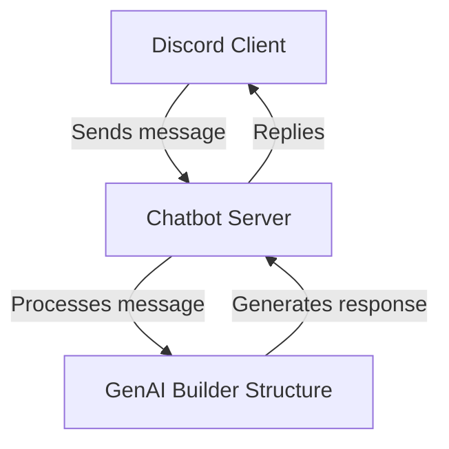

# 🤖 sample Discord Chatbot Server

This is a Discord bot server that integrates with Griptape AI to process and respond to messages in Discord channels.

## ⚠️ Disclaimer

The Chatbot server is provided for educational and demonstration purposes. Use responsibly and at your own risk.

- **Bot tokens and API keys are sensitive.** Never share them or commit them to public repositories.
- Ensure you have permission to add bots to any Discord server.
- Review and limit bot permissions to only what is necessary.
- The authors are not responsible for any misuse or security issues.

## 🧩 How It Works

1. A user sends a message in a Discord channel where the bot is present
2. The bot receives the message, processes it through Griptape API
3. The bot replies in the same channel




## 🔑 Enable Discord Application & Get API Token

1. Go to the [Discord Developer Portal](https://discord.com/developers/applications).
2. Click **New Application** and give it a name.
3. In the sidebar, go to **Bot** and click **Add Bot**.
4. Under **Token**, click **Reset Token** if needed, then **Copy** to get your bot token.
   - **Important:** Treat your bot token like a password. Never share it or commit it to public repositories.
5. Save this token for your `.env` file as `DISCORD_BOT_TOKEN`.
6. To invite the bot to your server:
   - Go to **OAuth2** > **URL Generator**.
   - Under **Scopes**, select `bot`.
   - Under **Bot Permissions**, select at least:
     - `Send Messages`
     - `Read Message History`
     - `View Channels`
   - Copy the generated URL and open it in your browser to invite the bot to your server.

### 🌐 Set Up OAuth and Select Discord Server

1. In the Discord Developer Portal, go to your application and select **OAuth2** > **URL Generator**.
2. Under **Scopes**, check `bot` (and optionally `applications.commands` if you use slash commands).
3. Under **Bot Permissions**, select the permissions your bot needs (see above).
4. Copy the generated OAuth2 URL.
5. Open the URL in your browser. You will be prompted to select a Discord server where you have permission to add bots.
6. Choose your server and authorize the bot.
7. The bot will be added to the selected server with the permissions you specified.

### 🛡️ Enable Bot Intents

To ensure your bot works correctly, you may need to enable specific Gateway Intents in the Discord Developer Portal:

1. In your application, go to the **Bot** section.
2. Scroll down to **Privileged Gateway Intents**.
3. Enable the following as needed:
   - `MESSAGE CONTENT INTENT` (required to read message content)
   - `SERVER MEMBERS INTENT` (if your bot needs member info)
   - `PRESENCE INTENT` (if your bot needs presence info)
4. Save your changes.

Make sure your bot code requests only the intents you have enabled. If you use privileged intents in your code, they must be enabled here.

## ⚙️ Chatbot Configuration

Create a `.env` file in your project root with the following:

```env
GENAI_BASE_URL=http://upm-griptape-web.upm-griptape.svc.cluster.local
GENAI_STRUCTURE_ID=your-genai-builder-structure-id
HM_ACCESS_KEY=your-hybrid-manager-access-key
DISCORD_BOT_TOKEN=your-discord-bot-token
```

Install dependencies:

```sh
npm install
```

Run the bot locally:

```sh
npm start
```

You can check the connection between the Chatbot server and Discord with local run of the Chatbot server.


## 🚀 Deploy the Chatbot to Kubernetes

1. Build the Docker image:
   ```sh
   docker build -t (your_docker_username)/genai-chatbot .
   ```
2. Push the image to your container registry (e.g., Docker Hub, GCR, etc.).
3. Update the Kubernetes manifest (`chatbot.yaml`) with your image and environment variables.
4. Deploy to your cluster:
   ```sh
   kubectl apply -f chatbot.yaml
   ```
5. (Optional) Use the provided shell scripts for deployment:
   - `build-deploy-chatbot-k8s.sh` to build and deploy in one step
   - `deploy-chatbot-k8s.sh` to deploy only

## 💬 How to Ask Prompts in Discord

Once the bot is running and invited to your server, you can interact with it by sending messages in any channel where the bot has access.

- **Simply type your question or prompt in the channel.**
- The bot will process your message and reply with an answer.
- Example:
  > What is the weather today?

No special prefix is required unless you have configured the bot to respond only to certain commands or mentions.

---

## 📝 Notes

- The bot ignores its own messages and other bots to prevent loops
- All configuration is done via the `.env` file (will be saved as K8s secret)
- For production, keep your bot token and API keys secure
- tested with Hybrid Manager 2025.11

---

## 📚 Appendix

usage of structure.py

```
usage: structure.py [-h] [-k KNOWLEDGE_BASE_ID] [-p PROMPT] [-r RULESET_ALIAS] [-s] [-t THREAD_ID]
```
